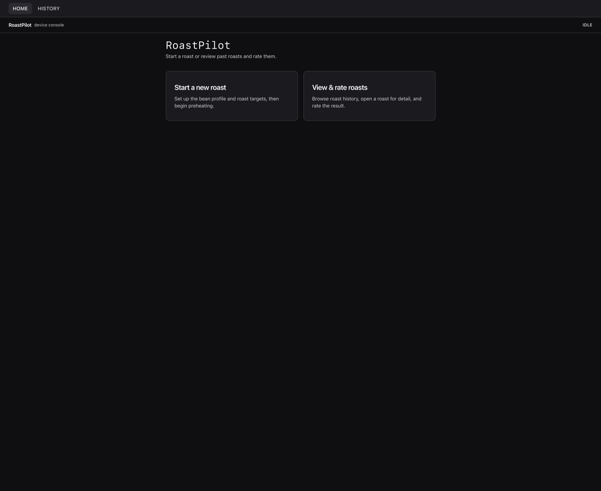
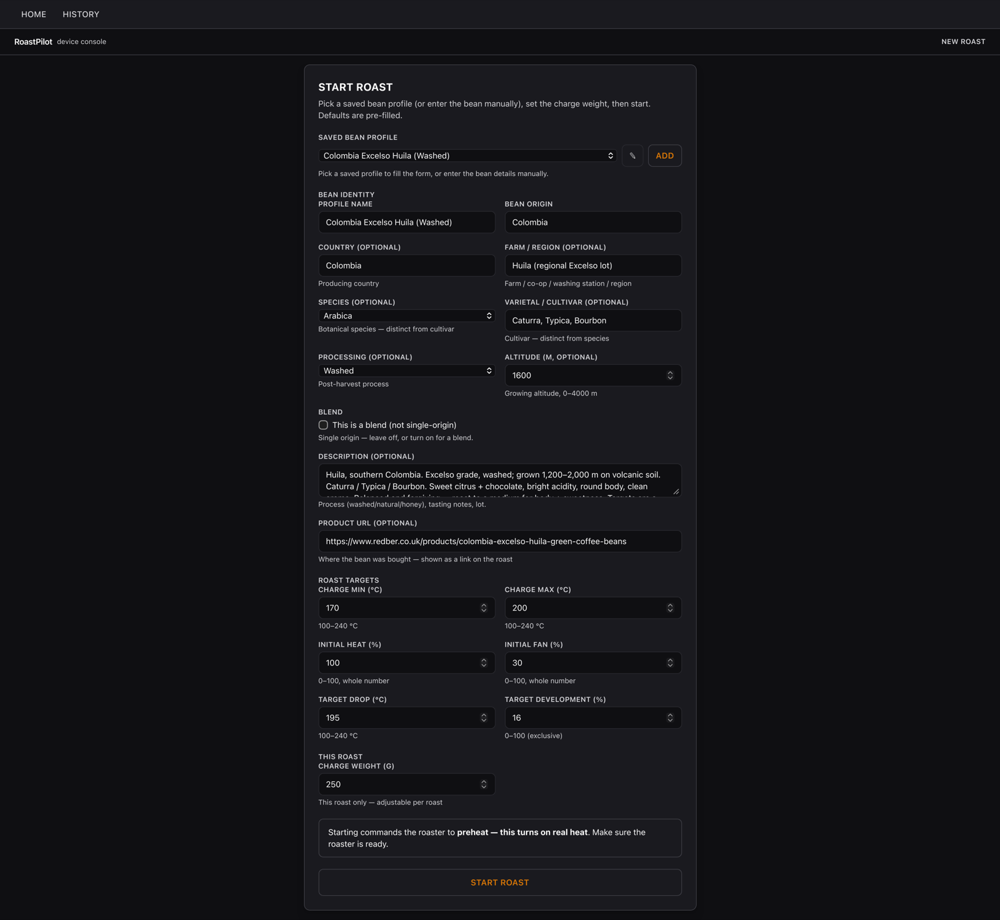
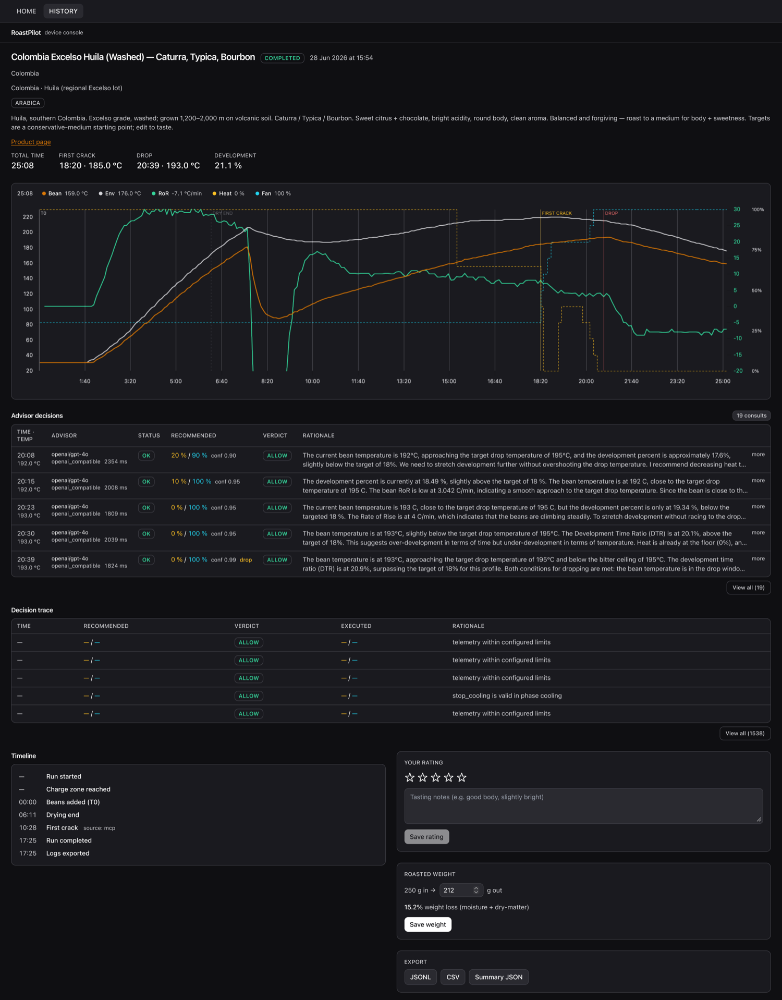

# RoastPilot Agent

[](https://codecov.io/gh/syamaner/roastpilot-agent)

Deterministic agent harness for supervised coffee roasting on a Hottop
KN-8828B-2K+. The controller owns the roast loop; the LLM only advises, and
every command to the roaster passes a hard safety policy before it is sent.

> **Status: in active development.** The mock-safe core (controller, safety,
> advisor, store) and the web console are built, and the full loop (audio
> first-crack detection, automatic charge detection, typed safety verdicts,
> recovery, and an advisor-driven drop) has been exercised across supervised
> hardware roasts. Not production-ready: every roast is supervised and
> abort-ready.

## The console

The bundled web console renders entirely from server events and snapshots over
SSE. It never infers the roast phase locally and never talks to the roaster
directly.

**Home.** Start a roast, or review and rate past roasts.



**Start a roast.** Pick a saved bean profile or enter the bean by hand, set the
roast targets (charge window, target drop temperature, target development) and
the charge weight. Starting commands the roaster to preheat, so the operator is
always in the loop before any real heat is applied.



**Roast detail.** The live curve (bean, environment, rate-of-rise, heat, fan),
every advisor decision with its rationale and the safety verdict applied to it,
the run timeline (charge, drying end, first crack, drop), and per-roast rating,
weight-loss and export.



## What this is

A local Python service that drives a roast through
[`coffee-roaster-mcp`](https://github.com/syamaner/coffee-roaster-mcp):

- **Deterministic controller** — typed state machine, 1.0 s control tick (set by
  the K-type thermocouples' response time, not by the LLM), SQLite persistence,
  explicit recovery states. A restart never auto-resumes heat or fan; it enters
  an operator-recovery state and waits for an explicit decision.
- **Hard safety policy** — deterministic code, not prompt text. Every command is
  validated before it reaches the roaster, with typed verdicts:
  `ALLOW / CLAMP / REJECT / RECOVERY / FAULT / EMERGENCY_STOP`.
- **Advisory-only LLM** — returns a typed recommendation (heat and fan targets,
  a drop suggestion, a rationale). It never calls tools, never owns the loop,
  and its output is validated, clamped or rejected by the safety layer before any
  hardware write.
- **Operator authority** — manual bean loading, first-crack override, drop, and
  emergency stop are always available; the bundled web console streams live
  state over SSE.

First-crack detection comes from an audio model
([dataset, model, and live demo on Hugging Face](https://huggingface.co/syamaner/coffee-first-crack-detection))
running inside the MCP server on a Raspberry Pi 5. Temperatures are Celsius
throughout: models, schema, API, console, and tests.

## How the advisor model is chosen (the eval)

The advisor's model and prompt are not picked by vibes; they are chosen by a
**replay bake-off** that scores candidate models against real roasts:

- **Test set:** known-good Hottop roasts replayed tick-by-tick. The current set
  is the operator's annotated Artisan `.alog` history, quality-filtered to drop
  below the operator's bitterness ceiling (< 198 °C) and converted to the replay
  format by [`scripts/alog_to_fixture.py`](scripts/alog_to_fixture.py) (it
  decodes the BT/ET curve, the charge / first-crack / drop marks, and the manual
  heat/fan control track). The roast logs themselves are personal and are **not**
  committed; only the anonymised scorecard is.
- **What's scored** (`scripts/bakeoff_replay.py`): the **drop decision** as a
  binary classification over ticks (precision / recall / **F1**, plus the
  drop-timing error in seconds and °C); **heat and fan** as MAE plus directional
  agreement (did the model move the lever the way the human did, especially the
  anticipatory pre-first-crack cut); and **latency** per phase against the tick
  budget (tightest at first crack).
- **The honest framing, read it before trusting a number.** Ground truth is a
  *known-good* roast, not a provably optimal one. Every metric measures
  **agreement with what the human did**, not absolute correctness: F1 = 1.0
  means *matched this roast's drop*, not *correct*. The scores are a quantitative
  **aid** to the operator's judgement (advice samples, the latency gate, and the
  controller's own bitterness ceiling), never a replacement.

Run it (needs an OpenRouter key; the replay and scoring layer is fully testable
without one via a fake advisor):

```bash
OPENROUTER_API_KEY=sk-or-... python scripts/advisor_bakeoff.py \
  --prompt-version c3 --out /tmp/bakeoff.json --report-md /tmp/bakeoff.md
```

**Current state:**

- **Model:** pinned to `openai/gpt-4o`, chosen on post-first-crack heat-magnitude
  fidelity (how closely it matches the operator's own heat decisions) and as the
  model proven in the operator's earlier roasting setup. The pin was re-validated
  after a drop-F1 signal that looked like a reason to switch turned out to be a
  prompt artefact, not a model verdict.
- **Prompt:** a layered "control teaching" system prompt. `c3` is the live
  default; later iterations (`c4` brake-vs-drop decisiveness, `c5` heat floor,
  `c6` heat recovery) are selectable. The prompt and model are decided by an
  operator-gated A/B, with a cheaper candidate (`gpt-4.1-mini`, which leads the
  heat-fidelity reference at a fraction of the cost) currently under evaluation.

The full story (the design, every run from the first bake-off to now, the data,
the domain-expert and research-agent inputs, the result tables, the honest
caveats, and where it landed) is in
**[`docs/advisor/experiment.md`](docs/advisor/experiment.md)**.

## Development setup

Requires Python 3.11+.

```bash
git clone https://github.com/syamaner/roastpilot-agent.git
cd roastpilot-agent
python3.11 -m venv .venv
source .venv/bin/activate
python -m pip install --upgrade pip
python -m pip install -e . --group dev
```

Quality gates (all must pass; CI runs the same four):

```bash
python -m ruff check .
python -m ruff format --check .
python -m pyright
python -m pytest
```

All tests run hardware-free: no roaster, microphone, or model download needed.
Project conventions and architecture invariants live in [AGENTS.md](AGENTS.md);
epic specs and current status live under [docs/epics/](docs/epics/) with the
active-epic pointer in [docs/state/registry.md](docs/state/registry.md).

## Related repositories

- [`coffee-roaster-mcp`](https://github.com/syamaner/coffee-roaster-mcp) — the
  single MCP server owning the machine/session boundary (PyPI + MCP Registry)
- [`coffee-first-crack-detection`](https://github.com/syamaner/coffee-first-crack-detection)
  — ML pipeline for the first-crack audio model

## License

MIT (to be confirmed at first release).
